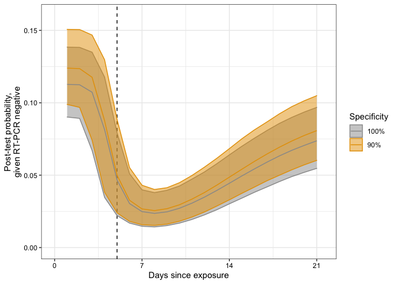

This code complements the submission “Variation in False Negative Rate
of RT-PCR Based SARS-CoV-2 Tests by Time Since Exposure”

Methods
-------

[Zhao et
al. (2020)](https://academic.oup.com/cid/advance-article/doi/10.1093/cid/ciaa344/5812996),
[Liu et
al. (2020)](https://www.medrxiv.org/content/10.1101/2020.03.06.20031856v1),
[Guo et
al. (2020)](https://academic.oup.com/cid/article-abstract/doi/10.1093/cid/ciaa310/5810754),
[Wölfel et
al. (2020)](https://www.nature.com/articles/s41586-020-2196-x), [Danis
et
al. (2020)](https://academic.oup.com/cid/article/doi/10.1093/cid/ciaa424/5819060),
[Kujawski et
al. (2020)](https://www.medrxiv.org/content/10.1101/2020.03.09.20032896v1.full),
[Kim et
al. (2020)](https://www.ncbi.nlm.nih.gov/pmc/articles/PMC7131901/), and
[Young et
al. (2020)](https://jamanetwork.com/journals/jama/article-abstract/2762688#note-JOI200030-1)
each looked at the sensitivity of the RT-PCR by time since symptom
onset.

The sensitivity rises to a peak 4 days after symptom onset then declines
for the next couple of weeks.

If we know the risk of an individual, we can find the negative
predictive value – the probability that someone who tests negative is
actually negative. From [Bi et
al.](https://www.medrxiv.org/content/10.1101/2020.03.03.20028423v3), we
know that about 15% (77/517) household contacts later tested positive
for covid-19.

We use logistic regression for the sensitivity of the RT-PCR with a
cubic polynomial for the log of time since exposure and use that, along
with the probability of infection given exposure, to estimate the
negative predictive value of the RT-PCR. We use estimates of the
incubation period from [Lauer, Grantz, et
al. (2020)](https://annals.org/aim/fullarticle/2762808/incubation-period-coronavirus-disease-2019-covid-19-from-publicly-reported).
From this, we can find the probability of having a covid-19 infection
despite being RT-PCR negative.

We use Stan for this analysis.

Results
-------

<table>
<thead>
<tr class="header">
<th style="text-align: right;">day</th>
<th style="text-align: left;">False negative rate (95% CI)</th>
<th style="text-align: left;">False omission rate (95% CI)</th>
<th style="text-align: left;">Rel. reduction in prob. pos.</th>
<th style="text-align: left;">Abs. reduction in prob. pos.</th>
</tr>
</thead>
<tbody>
<tr class="odd">
<td style="text-align: right;">1</td>
<td style="text-align: left;">100.0% (100.0-100.0%)</td>
<td style="text-align: left;">11.3% (9.0-13.8%)</td>
<td style="text-align: left;">0.0% (-0.0-0.0%)</td>
<td style="text-align: left;">0.0% (-0.0-0.0%)</td>
</tr>
<tr class="even">
<td style="text-align: right;">2</td>
<td style="text-align: left;">100.0% (96.0-100.0%)</td>
<td style="text-align: left;">11.2% (8.9-13.8%)</td>
<td style="text-align: left;">0.0% (0.0-3.6%)</td>
<td style="text-align: left;">0.0% (0.0-0.4%)</td>
</tr>
<tr class="odd">
<td style="text-align: right;">3</td>
<td style="text-align: left;">97.7% (58.8-99.9%)</td>
<td style="text-align: left;">10.7% (6.7-13.5%)</td>
<td style="text-align: left;">2.0% (0.1-38.3%)</td>
<td style="text-align: left;">0.2% (0.0-4.2%)</td>
</tr>
<tr class="even">
<td style="text-align: right;">4</td>
<td style="text-align: left;">71.0% (29.6-94.1%)</td>
<td style="text-align: left;">8.1% (3.5-11.8%)</td>
<td style="text-align: left;">26.5% (5.3-67.7%)</td>
<td style="text-align: left;">3.0% (0.6-7.8%)</td>
</tr>
<tr class="odd">
<td style="text-align: right;">5</td>
<td style="text-align: left;">38.7% (18.4-64.6%)</td>
<td style="text-align: left;">4.7% (2.2-7.9%)</td>
<td style="text-align: left;">58.5% (32.7-79.7%)</td>
<td style="text-align: left;">6.5% (3.5-9.6%)</td>
</tr>
<tr class="even">
<td style="text-align: right;">6</td>
<td style="text-align: left;">24.8% (14.0-39.9%)</td>
<td style="text-align: left;">3.0% (1.7-5.1%)</td>
<td style="text-align: left;">72.9% (57.3-84.4%)</td>
<td style="text-align: left;">8.2% (6.0-10.5%)</td>
</tr>
<tr class="odd">
<td style="text-align: right;">7</td>
<td style="text-align: left;">20.1% (12.5-31.0%)</td>
<td style="text-align: left;">2.5% (1.5-4.0%)</td>
<td style="text-align: left;">77.9% (66.3-86.2%)</td>
<td style="text-align: left;">8.7% (6.7-11.0%)</td>
</tr>
<tr class="even">
<td style="text-align: right;">8</td>
<td style="text-align: left;">19.1% (12.0-29.1%)</td>
<td style="text-align: left;">2.4% (1.4-3.8%)</td>
<td style="text-align: left;">78.9% (68.3-86.6%)</td>
<td style="text-align: left;">8.9% (6.9-11.2%)</td>
</tr>
<tr class="odd">
<td style="text-align: right;">9</td>
<td style="text-align: left;">20.0% (12.8-30.2%)</td>
<td style="text-align: left;">2.5% (1.5-4.0%)</td>
<td style="text-align: left;">78.0% (67.4-85.8%)</td>
<td style="text-align: left;">8.8% (6.8-11.0%)</td>
</tr>
<tr class="even">
<td style="text-align: right;">10</td>
<td style="text-align: left;">22.1% (14.5-32.7%)</td>
<td style="text-align: left;">2.7% (1.7-4.3%)</td>
<td style="text-align: left;">75.8% (64.7-84.0%)</td>
<td style="text-align: left;">8.5% (6.6-10.7%)</td>
</tr>
<tr class="odd">
<td style="text-align: right;">11</td>
<td style="text-align: left;">25.0% (16.7-36.0%)</td>
<td style="text-align: left;">3.1% (1.9-4.7%)</td>
<td style="text-align: left;">72.7% (61.1-81.5%)</td>
<td style="text-align: left;">8.2% (6.3-10.3%)</td>
</tr>
<tr class="even">
<td style="text-align: right;">12</td>
<td style="text-align: left;">28.6% (19.5-40.1%)</td>
<td style="text-align: left;">3.5% (2.3-5.2%)</td>
<td style="text-align: left;">69.0% (57.0-78.6%)</td>
<td style="text-align: left;">7.7% (5.9-9.9%)</td>
</tr>
<tr class="odd">
<td style="text-align: right;">13</td>
<td style="text-align: left;">32.5% (22.6-44.4%)</td>
<td style="text-align: left;">3.9% (2.6-5.8%)</td>
<td style="text-align: left;">64.8% (52.6-75.1%)</td>
<td style="text-align: left;">7.3% (5.5-9.3%)</td>
</tr>
<tr class="even">
<td style="text-align: right;">14</td>
<td style="text-align: left;">36.8% (26.2-49.0%)</td>
<td style="text-align: left;">4.4% (3.0-6.4%)</td>
<td style="text-align: left;">60.4% (47.9-71.5%)</td>
<td style="text-align: left;">6.8% (5.1-8.8%)</td>
</tr>
<tr class="odd">
<td style="text-align: right;">15</td>
<td style="text-align: left;">41.2% (30.0-53.6%)</td>
<td style="text-align: left;">4.9% (3.4-7.0%)</td>
<td style="text-align: left;">55.8% (43.5-67.5%)</td>
<td style="text-align: left;">6.3% (4.6-8.2%)</td>
</tr>
<tr class="even">
<td style="text-align: right;">16</td>
<td style="text-align: left;">45.5% (33.8-58.0%)</td>
<td style="text-align: left;">5.4% (3.8-7.6%)</td>
<td style="text-align: left;">51.5% (39.1-63.5%)</td>
<td style="text-align: left;">5.8% (4.1-7.7%)</td>
</tr>
<tr class="odd">
<td style="text-align: right;">17</td>
<td style="text-align: left;">49.6% (37.6-62.1%)</td>
<td style="text-align: left;">5.9% (4.2-8.1%)</td>
<td style="text-align: left;">47.4% (35.2-59.6%)</td>
<td style="text-align: left;">5.3% (3.7-7.2%)</td>
</tr>
<tr class="even">
<td style="text-align: right;">18</td>
<td style="text-align: left;">53.5% (41.2-65.7%)</td>
<td style="text-align: left;">6.3% (4.6-8.6%)</td>
<td style="text-align: left;">43.5% (31.8-55.9%)</td>
<td style="text-align: left;">4.9% (3.4-6.7%)</td>
</tr>
<tr class="odd">
<td style="text-align: right;">19</td>
<td style="text-align: left;">57.0% (44.6-68.9%)</td>
<td style="text-align: left;">6.7% (4.9-9.0%)</td>
<td style="text-align: left;">40.1% (28.7-52.3%)</td>
<td style="text-align: left;">4.5% (3.1-6.2%)</td>
</tr>
<tr class="even">
<td style="text-align: right;">20</td>
<td style="text-align: left;">60.2% (47.8-71.6%)</td>
<td style="text-align: left;">7.1% (5.2-9.4%)</td>
<td style="text-align: left;">37.0% (25.9-49.1%)</td>
<td style="text-align: left;">4.2% (2.8-5.8%)</td>
</tr>
<tr class="odd">
<td style="text-align: right;">21</td>
<td style="text-align: left;">63.0% (50.8-74.2%)</td>
<td style="text-align: left;">7.4% (5.5-9.7%)</td>
<td style="text-align: left;">34.3% (23.6-46.2%)</td>
<td style="text-align: left;">3.9% (2.6-5.5%)</td>
</tr>
</tbody>
</table>

With no data on RT-PCR to time prior to symptom onset, the estimates of
sensitivity at or below day five are low with large credible intervals.
Due to the decline in sensitivity over time, the RT-PCR test is best
deployed about a week after exposure. A day or two after exposure (3 or
4 days prior to symptoms), the test may have no utility at all, and thus
the probability of having been infected is would be the same with or
without an RT-PCR, in our case about 11%. Seven to nine days after
exposure (roughly 2 to 4 days after symptom onset), the negative
predictive value is around 95%, meaning there is about a 5% chance of
actually being covid-19 positive despite testing negative.

Sensitivity analyses
--------------------

### Specificity

What if the specificity of the test is less than 100%? To test this we
fit the same model except with a specificity of 90% and compared the
results to the original (the sensitivity remained the same).

<table>
<thead>
<tr class="header">
<th style="text-align: right;">Day</th>
<th style="text-align: left;">False omission rate (90% spec.)</th>
<th style="text-align: left;">False omission rate (100% spec.)</th>
<th style="text-align: left;">Rel. increase in FOR</th>
<th style="text-align: left;">Abs. increase in FOR</th>
</tr>
</thead>
<tbody>
<tr class="odd">
<td style="text-align: right;">1</td>
<td style="text-align: left;">12.4%</td>
<td style="text-align: left;">11.3%</td>
<td style="text-align: left;">9.9%</td>
<td style="text-align: left;">1.1%</td>
</tr>
<tr class="even">
<td style="text-align: right;">2</td>
<td style="text-align: left;">12.4%</td>
<td style="text-align: left;">11.2%</td>
<td style="text-align: left;">10.0%</td>
<td style="text-align: left;">1.1%</td>
</tr>
<tr class="odd">
<td style="text-align: right;">3</td>
<td style="text-align: left;">11.8%</td>
<td style="text-align: left;">10.7%</td>
<td style="text-align: left;">9.6%</td>
<td style="text-align: left;">1.0%</td>
</tr>
<tr class="even">
<td style="text-align: right;">4</td>
<td style="text-align: left;">8.8%</td>
<td style="text-align: left;">8.1%</td>
<td style="text-align: left;">7.6%</td>
<td style="text-align: left;">0.6%</td>
</tr>
<tr class="odd">
<td style="text-align: right;">5</td>
<td style="text-align: left;">5.0%</td>
<td style="text-align: left;">4.7%</td>
<td style="text-align: left;">7.2%</td>
<td style="text-align: left;">0.3%</td>
</tr>
<tr class="even">
<td style="text-align: right;">6</td>
<td style="text-align: left;">3.3%</td>
<td style="text-align: left;">3.0%</td>
<td style="text-align: left;">7.5%</td>
<td style="text-align: left;">0.2%</td>
</tr>
<tr class="odd">
<td style="text-align: right;">7</td>
<td style="text-align: left;">2.7%</td>
<td style="text-align: left;">2.5%</td>
<td style="text-align: left;">7.5%</td>
<td style="text-align: left;">0.2%</td>
</tr>
<tr class="even">
<td style="text-align: right;">8</td>
<td style="text-align: left;">2.6%</td>
<td style="text-align: left;">2.4%</td>
<td style="text-align: left;">8.1%</td>
<td style="text-align: left;">0.2%</td>
</tr>
<tr class="odd">
<td style="text-align: right;">9</td>
<td style="text-align: left;">2.7%</td>
<td style="text-align: left;">2.5%</td>
<td style="text-align: left;">8.8%</td>
<td style="text-align: left;">0.2%</td>
</tr>
<tr class="even">
<td style="text-align: right;">10</td>
<td style="text-align: left;">3.0%</td>
<td style="text-align: left;">2.7%</td>
<td style="text-align: left;">8.8%</td>
<td style="text-align: left;">0.2%</td>
</tr>
<tr class="odd">
<td style="text-align: right;">11</td>
<td style="text-align: left;">3.3%</td>
<td style="text-align: left;">3.1%</td>
<td style="text-align: left;">9.1%</td>
<td style="text-align: left;">0.3%</td>
</tr>
<tr class="even">
<td style="text-align: right;">12</td>
<td style="text-align: left;">3.8%</td>
<td style="text-align: left;">3.5%</td>
<td style="text-align: left;">9.1%</td>
<td style="text-align: left;">0.3%</td>
</tr>
<tr class="odd">
<td style="text-align: right;">13</td>
<td style="text-align: left;">4.3%</td>
<td style="text-align: left;">3.9%</td>
<td style="text-align: left;">9.3%</td>
<td style="text-align: left;">0.4%</td>
</tr>
<tr class="even">
<td style="text-align: right;">14</td>
<td style="text-align: left;">4.9%</td>
<td style="text-align: left;">4.4%</td>
<td style="text-align: left;">9.5%</td>
<td style="text-align: left;">0.4%</td>
</tr>
<tr class="odd">
<td style="text-align: right;">15</td>
<td style="text-align: left;">5.4%</td>
<td style="text-align: left;">4.9%</td>
<td style="text-align: left;">9.4%</td>
<td style="text-align: left;">0.5%</td>
</tr>
<tr class="even">
<td style="text-align: right;">16</td>
<td style="text-align: left;">5.9%</td>
<td style="text-align: left;">5.4%</td>
<td style="text-align: left;">9.5%</td>
<td style="text-align: left;">0.5%</td>
</tr>
<tr class="odd">
<td style="text-align: right;">17</td>
<td style="text-align: left;">6.5%</td>
<td style="text-align: left;">5.9%</td>
<td style="text-align: left;">9.5%</td>
<td style="text-align: left;">0.6%</td>
</tr>
<tr class="even">
<td style="text-align: right;">18</td>
<td style="text-align: left;">6.9%</td>
<td style="text-align: left;">6.3%</td>
<td style="text-align: left;">9.5%</td>
<td style="text-align: left;">0.6%</td>
</tr>
<tr class="odd">
<td style="text-align: right;">19</td>
<td style="text-align: left;">7.4%</td>
<td style="text-align: left;">6.7%</td>
<td style="text-align: left;">9.6%</td>
<td style="text-align: left;">0.6%</td>
</tr>
<tr class="even">
<td style="text-align: right;">20</td>
<td style="text-align: left;">7.7%</td>
<td style="text-align: left;">7.1%</td>
<td style="text-align: left;">9.7%</td>
<td style="text-align: left;">0.7%</td>
</tr>
<tr class="odd">
<td style="text-align: right;">21</td>
<td style="text-align: left;">8.1%</td>
<td style="text-align: left;">7.4%</td>
<td style="text-align: left;">9.5%</td>
<td style="text-align: left;">0.7%</td>
</tr>
</tbody>
</table>

The shape of the curve for 90% specificity is similar to that of 100%,
though slightly elevated. The best time to test is still 2-4 days
post-symptom onset.

### Different pre-test probabilities

We tested pre-test probabilities of half, twice, and four times that of
Bi et al. (2020).

<table>
<thead>
<tr class="header">
<th style="text-align: right;">day</th>
<th style="text-align: left;">attack rate</th>
<th style="text-align: right;">FOR</th>
<th style="text-align: right;">FOR LB</th>
<th style="text-align: right;">FOR UB</th>
</tr>
</thead>
<tbody>
<tr class="odd">
<td style="text-align: right;">1</td>
<td style="text-align: left;">half</td>
<td style="text-align: right;">5.6</td>
<td style="text-align: right;">4.1</td>
<td style="text-align: right;">7.4</td>
</tr>
<tr class="even">
<td style="text-align: right;">2</td>
<td style="text-align: left;">half</td>
<td style="text-align: right;">5.6</td>
<td style="text-align: right;">4.0</td>
<td style="text-align: right;">7.4</td>
</tr>
<tr class="odd">
<td style="text-align: right;">3</td>
<td style="text-align: left;">half</td>
<td style="text-align: right;">5.3</td>
<td style="text-align: right;">3.1</td>
<td style="text-align: right;">7.2</td>
</tr>
<tr class="even">
<td style="text-align: right;">4</td>
<td style="text-align: left;">half</td>
<td style="text-align: right;">3.9</td>
<td style="text-align: right;">1.6</td>
<td style="text-align: right;">6.1</td>
</tr>
<tr class="odd">
<td style="text-align: right;">5</td>
<td style="text-align: left;">half</td>
<td style="text-align: right;">2.2</td>
<td style="text-align: right;">1.0</td>
<td style="text-align: right;">4.0</td>
</tr>
<tr class="even">
<td style="text-align: right;">6</td>
<td style="text-align: left;">half</td>
<td style="text-align: right;">1.4</td>
<td style="text-align: right;">0.7</td>
<td style="text-align: right;">2.5</td>
</tr>
<tr class="odd">
<td style="text-align: right;">7</td>
<td style="text-align: left;">half</td>
<td style="text-align: right;">1.1</td>
<td style="text-align: right;">0.6</td>
<td style="text-align: right;">2.0</td>
</tr>
<tr class="even">
<td style="text-align: right;">8</td>
<td style="text-align: left;">half</td>
<td style="text-align: right;">1.1</td>
<td style="text-align: right;">0.6</td>
<td style="text-align: right;">1.9</td>
</tr>
<tr class="odd">
<td style="text-align: right;">9</td>
<td style="text-align: left;">half</td>
<td style="text-align: right;">1.2</td>
<td style="text-align: right;">0.7</td>
<td style="text-align: right;">1.9</td>
</tr>
<tr class="even">
<td style="text-align: right;">1</td>
<td style="text-align: left;">2x</td>
<td style="text-align: right;">22.5</td>
<td style="text-align: right;">19.4</td>
<td style="text-align: right;">25.8</td>
</tr>
<tr class="odd">
<td style="text-align: right;">2</td>
<td style="text-align: left;">2x</td>
<td style="text-align: right;">22.4</td>
<td style="text-align: right;">19.2</td>
<td style="text-align: right;">25.7</td>
</tr>
<tr class="even">
<td style="text-align: right;">3</td>
<td style="text-align: left;">2x</td>
<td style="text-align: right;">21.6</td>
<td style="text-align: right;">14.3</td>
<td style="text-align: right;">25.2</td>
</tr>
<tr class="odd">
<td style="text-align: right;">4</td>
<td style="text-align: left;">2x</td>
<td style="text-align: right;">16.8</td>
<td style="text-align: right;">7.8</td>
<td style="text-align: right;">22.6</td>
</tr>
<tr class="even">
<td style="text-align: right;">5</td>
<td style="text-align: left;">2x</td>
<td style="text-align: right;">9.9</td>
<td style="text-align: right;">4.9</td>
<td style="text-align: right;">16.1</td>
</tr>
<tr class="odd">
<td style="text-align: right;">6</td>
<td style="text-align: left;">2x</td>
<td style="text-align: right;">6.6</td>
<td style="text-align: right;">3.8</td>
<td style="text-align: right;">10.6</td>
</tr>
<tr class="even">
<td style="text-align: right;">7</td>
<td style="text-align: left;">2x</td>
<td style="text-align: right;">5.4</td>
<td style="text-align: right;">3.3</td>
<td style="text-align: right;">8.4</td>
</tr>
<tr class="odd">
<td style="text-align: right;">8</td>
<td style="text-align: left;">2x</td>
<td style="text-align: right;">5.2</td>
<td style="text-align: right;">3.2</td>
<td style="text-align: right;">7.9</td>
</tr>
<tr class="even">
<td style="text-align: right;">9</td>
<td style="text-align: left;">2x</td>
<td style="text-align: right;">5.4</td>
<td style="text-align: right;">3.4</td>
<td style="text-align: right;">8.1</td>
</tr>
<tr class="odd">
<td style="text-align: right;">1</td>
<td style="text-align: left;">4x</td>
<td style="text-align: right;">44.9</td>
<td style="text-align: right;">41.3</td>
<td style="text-align: right;">48.6</td>
</tr>
<tr class="even">
<td style="text-align: right;">2</td>
<td style="text-align: left;">4x</td>
<td style="text-align: right;">44.8</td>
<td style="text-align: right;">40.8</td>
<td style="text-align: right;">48.6</td>
</tr>
<tr class="odd">
<td style="text-align: right;">3</td>
<td style="text-align: left;">4x</td>
<td style="text-align: right;">43.7</td>
<td style="text-align: right;">31.0</td>
<td style="text-align: right;">47.9</td>
</tr>
<tr class="even">
<td style="text-align: right;">4</td>
<td style="text-align: left;">4x</td>
<td style="text-align: right;">36.0</td>
<td style="text-align: right;">18.6</td>
<td style="text-align: right;">44.5</td>
</tr>
<tr class="odd">
<td style="text-align: right;">5</td>
<td style="text-align: left;">4x</td>
<td style="text-align: right;">23.5</td>
<td style="text-align: right;">12.6</td>
<td style="text-align: right;">34.9</td>
</tr>
<tr class="even">
<td style="text-align: right;">6</td>
<td style="text-align: left;">4x</td>
<td style="text-align: right;">16.6</td>
<td style="text-align: right;">9.9</td>
<td style="text-align: right;">24.4</td>
</tr>
<tr class="odd">
<td style="text-align: right;">7</td>
<td style="text-align: left;">4x</td>
<td style="text-align: right;">13.9</td>
<td style="text-align: right;">8.8</td>
<td style="text-align: right;">20.0</td>
</tr>
<tr class="even">
<td style="text-align: right;">8</td>
<td style="text-align: left;">4x</td>
<td style="text-align: right;">13.3</td>
<td style="text-align: right;">8.6</td>
<td style="text-align: right;">18.7</td>
</tr>
<tr class="odd">
<td style="text-align: right;">9</td>
<td style="text-align: left;">4x</td>
<td style="text-align: right;">13.9</td>
<td style="text-align: right;">9.1</td>
<td style="text-align: right;">19.2</td>
</tr>
</tbody>
</table>

### Different incubation period lengths

We originally assumed a 5-day incubation period, what if that was 3 or 7
days instead?

<table>
<thead>
<tr class="header">
<th style="text-align: right;">day</th>
<th style="text-align: left;">inc period</th>
<th style="text-align: right;">FOR</th>
<th style="text-align: right;">FOR LB</th>
<th style="text-align: right;">FOR UB</th>
</tr>
</thead>
<tbody>
<tr class="odd">
<td style="text-align: right;">1</td>
<td style="text-align: left;">3d</td>
<td style="text-align: right;">11.3</td>
<td style="text-align: right;">8.9</td>
<td style="text-align: right;">13.7</td>
</tr>
<tr class="even">
<td style="text-align: right;">2</td>
<td style="text-align: left;">3d</td>
<td style="text-align: right;">10.0</td>
<td style="text-align: right;">4.9</td>
<td style="text-align: right;">12.9</td>
</tr>
<tr class="odd">
<td style="text-align: right;">3</td>
<td style="text-align: left;">3d</td>
<td style="text-align: right;">5.3</td>
<td style="text-align: right;">2.4</td>
<td style="text-align: right;">8.9</td>
</tr>
<tr class="even">
<td style="text-align: right;">4</td>
<td style="text-align: left;">3d</td>
<td style="text-align: right;">2.9</td>
<td style="text-align: right;">1.6</td>
<td style="text-align: right;">5.0</td>
</tr>
<tr class="odd">
<td style="text-align: right;">5</td>
<td style="text-align: left;">3d</td>
<td style="text-align: right;">2.3</td>
<td style="text-align: right;">1.4</td>
<td style="text-align: right;">3.8</td>
</tr>
<tr class="even">
<td style="text-align: right;">6</td>
<td style="text-align: left;">3d</td>
<td style="text-align: right;">2.2</td>
<td style="text-align: right;">1.3</td>
<td style="text-align: right;">3.6</td>
</tr>
<tr class="odd">
<td style="text-align: right;">7</td>
<td style="text-align: left;">3d</td>
<td style="text-align: right;">2.4</td>
<td style="text-align: right;">1.5</td>
<td style="text-align: right;">3.8</td>
</tr>
<tr class="even">
<td style="text-align: right;">8</td>
<td style="text-align: left;">3d</td>
<td style="text-align: right;">2.7</td>
<td style="text-align: right;">1.7</td>
<td style="text-align: right;">4.1</td>
</tr>
<tr class="odd">
<td style="text-align: right;">9</td>
<td style="text-align: left;">3d</td>
<td style="text-align: right;">3.1</td>
<td style="text-align: right;">2.0</td>
<td style="text-align: right;">4.6</td>
</tr>
<tr class="even">
<td style="text-align: right;">10</td>
<td style="text-align: left;">3d</td>
<td style="text-align: right;">3.5</td>
<td style="text-align: right;">2.3</td>
<td style="text-align: right;">5.2</td>
</tr>
<tr class="odd">
<td style="text-align: right;">11</td>
<td style="text-align: left;">3d</td>
<td style="text-align: right;">4.0</td>
<td style="text-align: right;">2.7</td>
<td style="text-align: right;">5.7</td>
</tr>
<tr class="even">
<td style="text-align: right;">12</td>
<td style="text-align: left;">3d</td>
<td style="text-align: right;">4.5</td>
<td style="text-align: right;">3.1</td>
<td style="text-align: right;">6.3</td>
</tr>
<tr class="odd">
<td style="text-align: right;">13</td>
<td style="text-align: left;">3d</td>
<td style="text-align: right;">5.0</td>
<td style="text-align: right;">3.5</td>
<td style="text-align: right;">6.9</td>
</tr>
<tr class="even">
<td style="text-align: right;">1</td>
<td style="text-align: left;">7d</td>
<td style="text-align: right;">11.3</td>
<td style="text-align: right;">9.1</td>
<td style="text-align: right;">13.8</td>
</tr>
<tr class="odd">
<td style="text-align: right;">2</td>
<td style="text-align: left;">7d</td>
<td style="text-align: right;">11.3</td>
<td style="text-align: right;">9.1</td>
<td style="text-align: right;">13.8</td>
</tr>
<tr class="even">
<td style="text-align: right;">3</td>
<td style="text-align: left;">7d</td>
<td style="text-align: right;">11.3</td>
<td style="text-align: right;">9.1</td>
<td style="text-align: right;">13.8</td>
</tr>
<tr class="odd">
<td style="text-align: right;">4</td>
<td style="text-align: left;">7d</td>
<td style="text-align: right;">11.1</td>
<td style="text-align: right;">8.2</td>
<td style="text-align: right;">13.6</td>
</tr>
<tr class="even">
<td style="text-align: right;">5</td>
<td style="text-align: left;">7d</td>
<td style="text-align: right;">9.8</td>
<td style="text-align: right;">5.1</td>
<td style="text-align: right;">12.8</td>
</tr>
<tr class="odd">
<td style="text-align: right;">6</td>
<td style="text-align: left;">7d</td>
<td style="text-align: right;">6.8</td>
<td style="text-align: right;">3.1</td>
<td style="text-align: right;">10.7</td>
</tr>
<tr class="even">
<td style="text-align: right;">7</td>
<td style="text-align: left;">7d</td>
<td style="text-align: right;">4.3</td>
<td style="text-align: right;">2.2</td>
<td style="text-align: right;">7.3</td>
</tr>
<tr class="odd">
<td style="text-align: right;">8</td>
<td style="text-align: left;">7d</td>
<td style="text-align: right;">3.1</td>
<td style="text-align: right;">1.7</td>
<td style="text-align: right;">5.0</td>
</tr>
<tr class="even">
<td style="text-align: right;">9</td>
<td style="text-align: left;">7d</td>
<td style="text-align: right;">2.6</td>
<td style="text-align: right;">1.5</td>
<td style="text-align: right;">4.1</td>
</tr>
<tr class="odd">
<td style="text-align: right;">10</td>
<td style="text-align: left;">7d</td>
<td style="text-align: right;">2.4</td>
<td style="text-align: right;">1.5</td>
<td style="text-align: right;">3.8</td>
</tr>
<tr class="even">
<td style="text-align: right;">11</td>
<td style="text-align: left;">7d</td>
<td style="text-align: right;">2.5</td>
<td style="text-align: right;">1.5</td>
<td style="text-align: right;">3.9</td>
</tr>
<tr class="odd">
<td style="text-align: right;">12</td>
<td style="text-align: left;">7d</td>
<td style="text-align: right;">2.8</td>
<td style="text-align: right;">1.7</td>
<td style="text-align: right;">4.1</td>
</tr>
<tr class="even">
<td style="text-align: right;">13</td>
<td style="text-align: left;">7d</td>
<td style="text-align: right;">3.1</td>
<td style="text-align: right;">1.9</td>
<td style="text-align: right;">4.6</td>
</tr>
</tbody>
</table>

Changing the length of the incubation period changes the progression of
the false omission rate (post-test probability given test negative).
Since the sensitivity is calibrated with respect to the time of symptom
onset, an earlier onset time leads to a quicker drop in false omission
rate and a later onset time leads to a slower drop.

### Shift ambiguous days one day earlier

The timing of the days since symptom onset are ambiguous in Guo et
al. and Kim et al., where day 1 may mean one day since symptom onset or
the first day of symptoms.

Shifting the timing of ambiguous days one day earlier improves the
median sensitivity of the early tests, such that the best days for
testing would shift from 2-4 days post-symptom onset to 1-3 days
post-symptom onset. The log-likelihoods for each model are nearly
identical with the shifted days being minutely better. The overlap in
credible intervals indicates that the estimates are roughly equivalent.

### Inconclusive tests as negatives or positives

Kujawski et al. and Danis et al. reported 21 inconclusive tests combined
in their data. In our main analysis, we omit these swabs, but they could
count as negative or positive tests instead.

The results are barely changed by including inconclusive tests as
negatives or positives instead of being omitted.

### Leave one study out

To see whether any study has undue influence over our results, we ran a
leave-one-study out analysis to see if the results changed.

### Incubation period as a random variable

    ## Running /Library/Frameworks/R.framework/Resources/bin/R CMD SHLIB foo.c
    ## clang -I"/Library/Frameworks/R.framework/Resources/include" -DNDEBUG   -I"/Library/Frameworks/R.framework/Versions/3.6/Resources/library/Rcpp/include/"  -I"/Library/Frameworks/R.framework/Versions/3.6/Resources/library/RcppEigen/include/"  -I"/Library/Frameworks/R.framework/Versions/3.6/Resources/library/RcppEigen/include/unsupported"  -I"/Library/Frameworks/R.framework/Versions/3.6/Resources/library/BH/include" -I"/Library/Frameworks/R.framework/Versions/3.6/Resources/library/StanHeaders/include/src/"  -I"/Library/Frameworks/R.framework/Versions/3.6/Resources/library/StanHeaders/include/"  -I"/Library/Frameworks/R.framework/Versions/3.6/Resources/library/rstan/include" -DEIGEN_NO_DEBUG  -D_REENTRANT  -DBOOST_DISABLE_ASSERTS -DBOOST_PENDING_INTEGER_LOG2_HPP -include stan/math/prim/mat/fun/Eigen.hpp   -isysroot /Library/Developer/CommandLineTools/SDKs/MacOSX.sdk -I/usr/local/include  -fPIC  -isysroot /Library/Developer/CommandLineTools/SDKs/MacOSX.sdk -c foo.c -o foo.o
    ## In file included from <built-in>:1:
    ## In file included from /Library/Frameworks/R.framework/Versions/3.6/Resources/library/StanHeaders/include/stan/math/prim/mat/fun/Eigen.hpp:13:
    ## In file included from /Library/Frameworks/R.framework/Versions/3.6/Resources/library/RcppEigen/include/Eigen/Dense:1:
    ## In file included from /Library/Frameworks/R.framework/Versions/3.6/Resources/library/RcppEigen/include/Eigen/Core:88:
    ## /Library/Frameworks/R.framework/Versions/3.6/Resources/library/RcppEigen/include/Eigen/src/Core/util/Macros.h:613:1: error: unknown type name 'namespace'
    ## namespace Eigen {
    ## ^
    ## /Library/Frameworks/R.framework/Versions/3.6/Resources/library/RcppEigen/include/Eigen/src/Core/util/Macros.h:613:16: error: expected ';' after top level declarator
    ## namespace Eigen {
    ##                ^
    ##                ;
    ## In file included from <built-in>:1:
    ## In file included from /Library/Frameworks/R.framework/Versions/3.6/Resources/library/StanHeaders/include/stan/math/prim/mat/fun/Eigen.hpp:13:
    ## In file included from /Library/Frameworks/R.framework/Versions/3.6/Resources/library/RcppEigen/include/Eigen/Dense:1:
    ## /Library/Frameworks/R.framework/Versions/3.6/Resources/library/RcppEigen/include/Eigen/Core:96:10: fatal error: 'complex' file not found
    ## #include <complex>
    ##          ^~~~~~~~~
    ## 3 errors generated.
    ## make: *** [foo.o] Error 1

<table>
<thead>
<tr class="header">
<th style="text-align: right;">days_since_exposure</th>
<th style="text-align: right;">fnr_med</th>
<th style="text-align: right;">fnr_lb</th>
<th style="text-align: right;">fnr_ub</th>
<th style="text-align: right;">for_med</th>
<th style="text-align: right;">for_lb</th>
<th style="text-align: right;">for_ub</th>
<th style="text-align: right;">rr_med</th>
<th style="text-align: right;">rr_lb</th>
<th style="text-align: right;">rr_ub</th>
<th style="text-align: right;">abs_med</th>
<th style="text-align: right;">abs_lb</th>
<th style="text-align: right;">abs_ub</th>
</tr>
</thead>
<tbody>
<tr class="odd">
<td style="text-align: right;">1</td>
<td style="text-align: right;">100.0</td>
<td style="text-align: right;">99.9</td>
<td style="text-align: right;">100.0</td>
<td style="text-align: right;">11.3</td>
<td style="text-align: right;">8.9</td>
<td style="text-align: right;">13.7</td>
<td style="text-align: right;">0.0</td>
<td style="text-align: right;">0.0</td>
<td style="text-align: right;">0.0</td>
<td style="text-align: right;">0.0</td>
<td style="text-align: right;">0.0</td>
<td style="text-align: right;">0.0</td>
</tr>
<tr class="even">
<td style="text-align: right;">2</td>
<td style="text-align: right;">100.0</td>
<td style="text-align: right;">82.0</td>
<td style="text-align: right;">100.0</td>
<td style="text-align: right;">11.2</td>
<td style="text-align: right;">8.4</td>
<td style="text-align: right;">13.7</td>
<td style="text-align: right;">0.0</td>
<td style="text-align: right;">0.0</td>
<td style="text-align: right;">16.1</td>
<td style="text-align: right;">0.0</td>
<td style="text-align: right;">0.0</td>
<td style="text-align: right;">1.9</td>
</tr>
<tr class="odd">
<td style="text-align: right;">3</td>
<td style="text-align: right;">99.2</td>
<td style="text-align: right;">38.7</td>
<td style="text-align: right;">100.0</td>
<td style="text-align: right;">10.9</td>
<td style="text-align: right;">4.6</td>
<td style="text-align: right;">13.5</td>
<td style="text-align: right;">0.7</td>
<td style="text-align: right;">0.0</td>
<td style="text-align: right;">58.5</td>
<td style="text-align: right;">0.1</td>
<td style="text-align: right;">0.0</td>
<td style="text-align: right;">6.7</td>
</tr>
<tr class="even">
<td style="text-align: right;">4</td>
<td style="text-align: right;">81.6</td>
<td style="text-align: right;">21.7</td>
<td style="text-align: right;">99.2</td>
<td style="text-align: right;">9.2</td>
<td style="text-align: right;">2.7</td>
<td style="text-align: right;">12.6</td>
<td style="text-align: right;">16.7</td>
<td style="text-align: right;">0.7</td>
<td style="text-align: right;">76.2</td>
<td style="text-align: right;">1.9</td>
<td style="text-align: right;">0.1</td>
<td style="text-align: right;">8.7</td>
</tr>
<tr class="odd">
<td style="text-align: right;">5</td>
<td style="text-align: right;">47.1</td>
<td style="text-align: right;">16.2</td>
<td style="text-align: right;">85.3</td>
<td style="text-align: right;">5.6</td>
<td style="text-align: right;">2.0</td>
<td style="text-align: right;">10.2</td>
<td style="text-align: right;">49.9</td>
<td style="text-align: right;">13.3</td>
<td style="text-align: right;">82.1</td>
<td style="text-align: right;">5.6</td>
<td style="text-align: right;">1.5</td>
<td style="text-align: right;">9.6</td>
</tr>
<tr class="even">
<td style="text-align: right;">6</td>
<td style="text-align: right;">28.5</td>
<td style="text-align: right;">13.9</td>
<td style="text-align: right;">54.9</td>
<td style="text-align: right;">3.5</td>
<td style="text-align: right;">1.7</td>
<td style="text-align: right;">6.8</td>
<td style="text-align: right;">68.9</td>
<td style="text-align: right;">42.1</td>
<td style="text-align: right;">84.5</td>
<td style="text-align: right;">7.7</td>
<td style="text-align: right;">4.7</td>
<td style="text-align: right;">10.4</td>
</tr>
<tr class="odd">
<td style="text-align: right;">7</td>
<td style="text-align: right;">21.7</td>
<td style="text-align: right;">12.4</td>
<td style="text-align: right;">36.9</td>
<td style="text-align: right;">2.7</td>
<td style="text-align: right;">1.5</td>
<td style="text-align: right;">4.7</td>
<td style="text-align: right;">76.2</td>
<td style="text-align: right;">60.1</td>
<td style="text-align: right;">86.2</td>
<td style="text-align: right;">8.5</td>
<td style="text-align: right;">6.4</td>
<td style="text-align: right;">10.8</td>
</tr>
<tr class="even">
<td style="text-align: right;">8</td>
<td style="text-align: right;">19.5</td>
<td style="text-align: right;">11.9</td>
<td style="text-align: right;">30.4</td>
<td style="text-align: right;">2.4</td>
<td style="text-align: right;">1.4</td>
<td style="text-align: right;">4.0</td>
<td style="text-align: right;">78.6</td>
<td style="text-align: right;">66.9</td>
<td style="text-align: right;">86.7</td>
<td style="text-align: right;">8.8</td>
<td style="text-align: right;">6.8</td>
<td style="text-align: right;">11.0</td>
</tr>
<tr class="odd">
<td style="text-align: right;">9</td>
<td style="text-align: right;">19.6</td>
<td style="text-align: right;">12.3</td>
<td style="text-align: right;">29.7</td>
<td style="text-align: right;">2.4</td>
<td style="text-align: right;">1.5</td>
<td style="text-align: right;">3.9</td>
<td style="text-align: right;">78.5</td>
<td style="text-align: right;">67.7</td>
<td style="text-align: right;">86.3</td>
<td style="text-align: right;">8.8</td>
<td style="text-align: right;">6.9</td>
<td style="text-align: right;">10.9</td>
</tr>
<tr class="even">
<td style="text-align: right;">10</td>
<td style="text-align: right;">21.1</td>
<td style="text-align: right;">13.3</td>
<td style="text-align: right;">31.5</td>
<td style="text-align: right;">2.6</td>
<td style="text-align: right;">1.6</td>
<td style="text-align: right;">4.1</td>
<td style="text-align: right;">76.8</td>
<td style="text-align: right;">65.6</td>
<td style="text-align: right;">85.2</td>
<td style="text-align: right;">8.6</td>
<td style="text-align: right;">6.7</td>
<td style="text-align: right;">10.7</td>
</tr>
<tr class="odd">
<td style="text-align: right;">11</td>
<td style="text-align: right;">23.6</td>
<td style="text-align: right;">15.1</td>
<td style="text-align: right;">34.7</td>
<td style="text-align: right;">2.9</td>
<td style="text-align: right;">1.8</td>
<td style="text-align: right;">4.5</td>
<td style="text-align: right;">74.2</td>
<td style="text-align: right;">62.5</td>
<td style="text-align: right;">83.2</td>
<td style="text-align: right;">8.3</td>
<td style="text-align: right;">6.4</td>
<td style="text-align: right;">10.4</td>
</tr>
<tr class="even">
<td style="text-align: right;">12</td>
<td style="text-align: right;">26.7</td>
<td style="text-align: right;">17.5</td>
<td style="text-align: right;">38.7</td>
<td style="text-align: right;">3.3</td>
<td style="text-align: right;">2.1</td>
<td style="text-align: right;">4.9</td>
<td style="text-align: right;">70.8</td>
<td style="text-align: right;">58.4</td>
<td style="text-align: right;">80.6</td>
<td style="text-align: right;">7.9</td>
<td style="text-align: right;">6.1</td>
<td style="text-align: right;">10.1</td>
</tr>
<tr class="odd">
<td style="text-align: right;">13</td>
<td style="text-align: right;">30.4</td>
<td style="text-align: right;">20.3</td>
<td style="text-align: right;">42.9</td>
<td style="text-align: right;">3.7</td>
<td style="text-align: right;">2.4</td>
<td style="text-align: right;">5.5</td>
<td style="text-align: right;">67.0</td>
<td style="text-align: right;">54.0</td>
<td style="text-align: right;">77.7</td>
<td style="text-align: right;">7.5</td>
<td style="text-align: right;">5.7</td>
<td style="text-align: right;">9.6</td>
</tr>
<tr class="even">
<td style="text-align: right;">14</td>
<td style="text-align: right;">34.5</td>
<td style="text-align: right;">23.7</td>
<td style="text-align: right;">47.6</td>
<td style="text-align: right;">4.2</td>
<td style="text-align: right;">2.7</td>
<td style="text-align: right;">6.0</td>
<td style="text-align: right;">62.8</td>
<td style="text-align: right;">49.4</td>
<td style="text-align: right;">74.0</td>
<td style="text-align: right;">7.0</td>
<td style="text-align: right;">5.2</td>
<td style="text-align: right;">9.1</td>
</tr>
<tr class="odd">
<td style="text-align: right;">15</td>
<td style="text-align: right;">38.7</td>
<td style="text-align: right;">27.3</td>
<td style="text-align: right;">52.2</td>
<td style="text-align: right;">4.7</td>
<td style="text-align: right;">3.1</td>
<td style="text-align: right;">6.6</td>
<td style="text-align: right;">58.4</td>
<td style="text-align: right;">44.8</td>
<td style="text-align: right;">70.2</td>
<td style="text-align: right;">6.5</td>
<td style="text-align: right;">4.8</td>
<td style="text-align: right;">8.6</td>
</tr>
<tr class="even">
<td style="text-align: right;">16</td>
<td style="text-align: right;">43.0</td>
<td style="text-align: right;">30.9</td>
<td style="text-align: right;">56.6</td>
<td style="text-align: right;">5.2</td>
<td style="text-align: right;">3.5</td>
<td style="text-align: right;">7.2</td>
<td style="text-align: right;">54.0</td>
<td style="text-align: right;">40.5</td>
<td style="text-align: right;">66.5</td>
<td style="text-align: right;">6.1</td>
<td style="text-align: right;">4.4</td>
<td style="text-align: right;">8.0</td>
</tr>
<tr class="odd">
<td style="text-align: right;">17</td>
<td style="text-align: right;">47.3</td>
<td style="text-align: right;">34.9</td>
<td style="text-align: right;">60.7</td>
<td style="text-align: right;">5.6</td>
<td style="text-align: right;">3.9</td>
<td style="text-align: right;">7.8</td>
<td style="text-align: right;">49.8</td>
<td style="text-align: right;">36.5</td>
<td style="text-align: right;">62.5</td>
<td style="text-align: right;">5.6</td>
<td style="text-align: right;">3.9</td>
<td style="text-align: right;">7.5</td>
</tr>
<tr class="even">
<td style="text-align: right;">18</td>
<td style="text-align: right;">51.2</td>
<td style="text-align: right;">38.7</td>
<td style="text-align: right;">64.3</td>
<td style="text-align: right;">6.1</td>
<td style="text-align: right;">4.3</td>
<td style="text-align: right;">8.2</td>
<td style="text-align: right;">45.8</td>
<td style="text-align: right;">33.0</td>
<td style="text-align: right;">58.6</td>
<td style="text-align: right;">5.1</td>
<td style="text-align: right;">3.6</td>
<td style="text-align: right;">7.0</td>
</tr>
<tr class="odd">
<td style="text-align: right;">19</td>
<td style="text-align: right;">54.9</td>
<td style="text-align: right;">42.1</td>
<td style="text-align: right;">67.7</td>
<td style="text-align: right;">6.5</td>
<td style="text-align: right;">4.7</td>
<td style="text-align: right;">8.7</td>
<td style="text-align: right;">42.2</td>
<td style="text-align: right;">29.7</td>
<td style="text-align: right;">54.9</td>
<td style="text-align: right;">4.7</td>
<td style="text-align: right;">3.2</td>
<td style="text-align: right;">6.5</td>
</tr>
<tr class="even">
<td style="text-align: right;">20</td>
<td style="text-align: right;">58.3</td>
<td style="text-align: right;">45.4</td>
<td style="text-align: right;">70.7</td>
<td style="text-align: right;">6.9</td>
<td style="text-align: right;">5.1</td>
<td style="text-align: right;">9.1</td>
<td style="text-align: right;">38.8</td>
<td style="text-align: right;">26.9</td>
<td style="text-align: right;">51.5</td>
<td style="text-align: right;">4.3</td>
<td style="text-align: right;">2.9</td>
<td style="text-align: right;">6.1</td>
</tr>
<tr class="odd">
<td style="text-align: right;">21</td>
<td style="text-align: right;">61.4</td>
<td style="text-align: right;">48.6</td>
<td style="text-align: right;">73.2</td>
<td style="text-align: right;">7.2</td>
<td style="text-align: right;">5.4</td>
<td style="text-align: right;">9.4</td>
<td style="text-align: right;">35.8</td>
<td style="text-align: right;">24.5</td>
<td style="text-align: right;">48.5</td>
<td style="text-align: right;">4.0</td>
<td style="text-align: right;">2.7</td>
<td style="text-align: right;">5.8</td>
</tr>
</tbody>
</table>

When the incubation period is treated as a random variable instead of a
fixed value, the confidence intervals for the false negative rate are
wider, especially in the first week of exposure.
